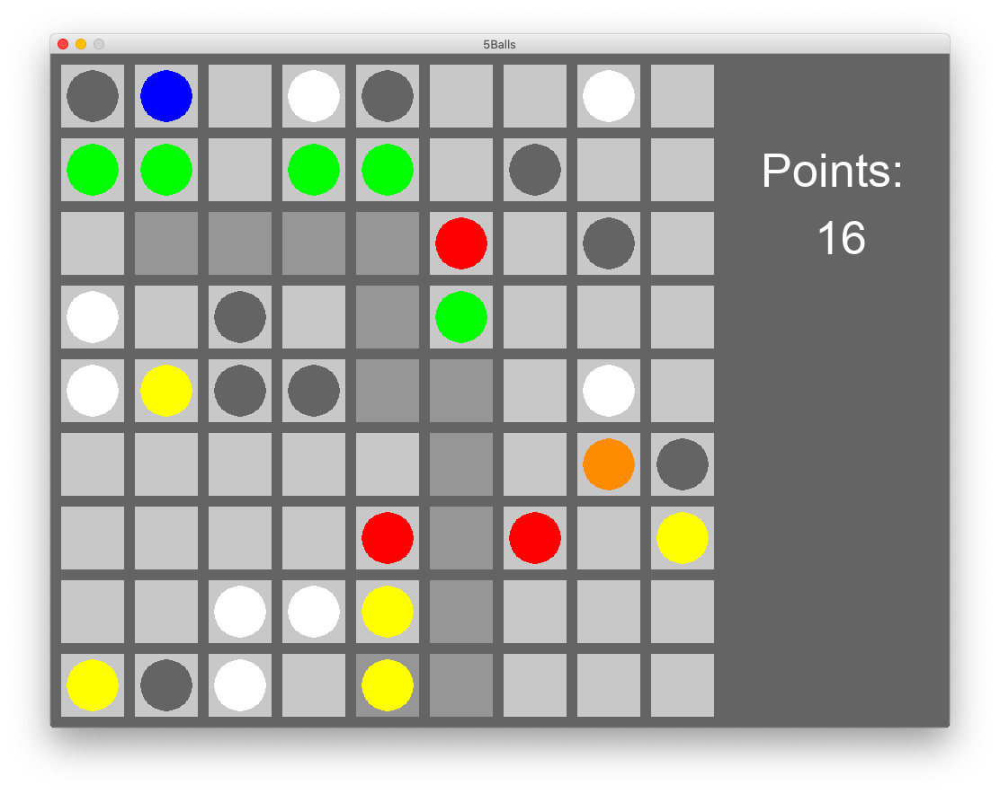

# 5Balls
2D game developed strictly to learn pygame. It's a simple game based on one that i used to play.

## Algorithm

Implemented A* algorithm - a pathfinding algorithm to find the shortest possible path.

## How it works

You have to place 5 or more balls in line to score points. Points are assigned accordingly to the number of balls in line. You lose the game when there is no room to create new ball.